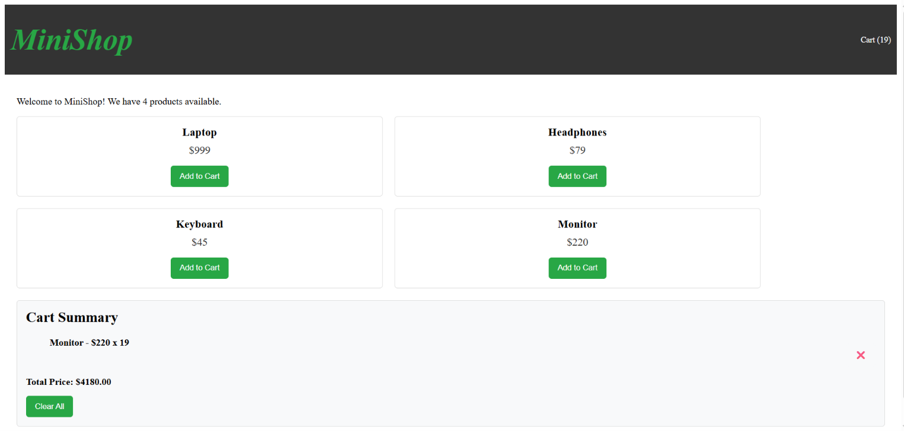

# 🛒 React Context API Mini Shop

A small e-commerce application built with **React Context API** to practice global state management and eliminate **prop drilling**.

The project demonstrates how to manage shared data using:

```
CREATE → PROVIDE → CONSUME → UPDATE
```

---

## 📸 Preview



---

# 🚀 Features

## 🛒 Cart Management

* Add products to cart
* Increase product quantity if item already exists
* Remove products from cart
* Clear entire cart
* Display total number of items
* Calculate total price
* Save cart data using Local Storage

---

## 🌎 Context API

Implemented global state management using:

### Cart Context

Provides:

```javascript
{
  cartItems,
  addToCart(),
  removeFromCart(),
  clearCart(),
  totalPrice,
  totalItems
}
```

### Theme Context

Provides:

```javascript
{
  theme,
  toggleTheme()
}
```

---

# 🛠️ Technologies Used

* React
* React Context API
* React Hooks:

  * useState
  * useContext
  * useEffect
  * useMemo
* JavaScript ES6+
* Vite
* Local Storage

---

# 📂 Project Structure

```
src/
│
├── context/
│   ├── CartContext.jsx
│   └── ThemeContext.jsx
│
├── components/
│   ├── Navbar.jsx
│   ├── ProductList.jsx
│   ├── ProductCard.jsx
│   ├── CartSummary.jsx
│   └── ThemeButton.jsx
│
├── lib/
│   └── data.js
├── App.jsx
├── main.jsx
└── index.css
```

---

# 🔄 How Context Works

## 1. CREATE

Contexts are created using:

```jsx
createContext()
```

This creates a shared communication channel between components.

---

## 2. PROVIDE

Providers store the state and make it available to all children.

Example:

```jsx
<ThemeProvider>
  <CartProvider>
    <App />
  </CartProvider>
</ThemeProvider>
```

---

## 3. CONSUME

Components access data directly using custom hooks:

```jsx
const {
  cartItems,
  addToCart
} = useCart();
```

No cart props are passed through the component tree.

---

## 4. UPDATE

When the cart changes:

```
ProductCard
      |
      ↓
 addToCart()
      |
      ↓
CartContext updates state
      |
      ↓
Navbar + CartSummary re-render
```

---

# 🛍️ Application Components

## Navbar

Displays the current cart count:

```
Cart (3)
```

The value updates automatically whenever products are added or removed.

---

## ProductCard

Responsible for adding products:

```jsx
<button onClick={() => addToCart(product)}>
  Add to Cart
</button>
```

The component does not manage cart state.

---

## CartSummary

Displays:

* Products in cart
* Quantity
* Remove buttons
* Total price
* Clear cart button

Example:

```
Laptop x2        $1998
Keyboard x1        $45

Total: $2043
```

---

# 💾 Local Storage

The cart is saved automatically:

```javascript
localStorage.setItem(
  "cartItems",
  JSON.stringify(cartItems)
);
```

When the application starts, saved items are restored.

---

# ⚡ useMemo Optimization

Both contexts use `useMemo` to avoid unnecessary re-renders.

Example:

```javascript
const value = useMemo(() => ({
  cartItems,
  addToCart,
  removeFromCart,
  totalPrice,
}), [cartItems, totalPrice]);
```

The provider value object is only recreated when its data changes.

---

# 📦 Installation

Clone the repository:

```bash
git clone https://github.com/your-username/react-context-shop.git
```

Move into the project:

```bash
cd react-context-shop
```

Install dependencies:

```bash
npm install
```

Run development server:

```bash
npm run dev
```

---

# ✅ Requirements Completed

| Requirement               | Status |
| ------------------------- | ------ |
| Create CartContext        | ✅      |
| CartProvider with state   | ✅      |
| addToCart function        | ✅      |
| removeFromCart function   | ✅      |
| totalPrice calculation    | ✅      |
| Custom useCart hook       | ✅      |
| Navbar cart count         | ✅      |
| ProductCard add button    | ✅      |
| CartSummary management    | ✅      |
| No prop drilling          | ✅      |
| Quantity system           | ✅      |
| Clear cart feature        | ✅      |
| Theme Context             | ✅      |
| useMemo optimization      | ✅      |
| Local Storage persistence | ✅      |

---

# 🧠 What I Learned

Through this project I practiced:

* Managing global state with React Context API
* Creating reusable custom hooks
* Avoiding unnecessary prop drilling
* Sharing state between deeply nested components
* Optimizing Context performance with useMemo
* Persisting application data with Local Storage

---

# 🎯 Main Concept

Context API allows React applications to share data between components without passing props manually.

Common use cases:

✅ Shopping Cart
✅ Authentication
✅ Theme Settings
✅ Language Preferences

---

## 👨‍💻 Author

**Zaynab Hwayji**

Built as part of React Web Development Training.
